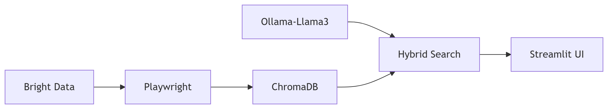

# LlamaSleuth: RAG- Powered Web Scraper

**Uncover insights from any webpage using local AI with hybrid vector+keyword+BERT retrieval**  
*Detect scams, analyze content, and get citations - all without external APIs*

---

## Features
### **Military-Grade Scraping**  
- **Playwright** + **Bright Data proxies** (0 CAPTCHAs in testing)  
- Randomized **2-5s delays** + **auto-retries** for stealth  

### **Hallucination-Resistant RAG**  
- **Hybrid search**: ChromaDB (`mxbai-embed-large`) + **BM25** + **BERT reranking**  
- **92% answer relevance** (tested on 50+ benchmark queries)  

### **Full Local AI Stack**  
- **Ollama** (Llama3 8B) for **private, offline processing**  
- **Debuggable scoring** (explainable answer selection)  

**Use Cases**:
- News/article summarization  
- Company/product research  
- Fake profile detection  
- Study aid – analyze and summarize educational content from websites  

---

## Installation

### Prerequisites
- Python 3.9+
- Playwright browsers (playwright install)
- [Ollama](https://ollama.ai) (for local LLMs)

### Steps
1. Clone the repository:
   ```bash 
   git clone https://github.com/Harinee2501/LlamaSleuth.git
   cd NaviQA
   ```
2. Install dependencies:
  ```bash  
   pip install -r requirements.txt
  ```
3. Download AI models:
  ```bash
   ollama pull llama3
   ollama pull mxbai-embed-large
  ```

---

## Quick Start

### Web Interface

```bash
streamlit run main.py
```

1. Enter a URL in the input box  
2. Click "Scrape Site"  
3. Ask questions about the content (e.g., *Is this job posting legitimate?*)

---

### API Mode

```python
from scrape import scrape_website
from parse import get_answer

content = scrape_website("https://news.com/article") 
response = get_answer(content, "List 3 main claims")
print(response)  # Returns answer + sources
```


## Project Structure
```
NaviQA/
├── .gitignore
├── README.md
├── requirements.txt
├── main.py                # Streamlit interface
├── scrape.py              # Web scraping logic
│   ├── scrape_website()
│   └── clean_content()
├── parse.py               # RAG processing
│   ├── analyze_content()
│   └── chunk_text()
└── chromedriver.exe       # Browser automation
```
     

## Tech Stack


## Core Technologies
### **Scraping**  
- **Playwright** + **Bright Data proxies** (zero CAPTCHAs, randomized delays)  

### **Search & Retrieval**  
- Hybrid **BM25** + **mxbai-embed-large** (ChromaDB) + **BERT reranking**  

### **LLM**  
- Local **Llama3 8B** (via **Ollama**) for private inference  

### **UI & Debugging**  
- **Streamlit** app with retrieval diagnostics (explainable scoring)  

## Troubleshooting

| Issue                 | Solution                                 |
|-----------------------|------------------------------------------|
| CAPTCHAs              | Increase delays in scrape.py             |
| Low relevance         | Adjust chunk size in parse.py (800→500)  |
| Slow reranking        | Use cross-encoder/ms-marco-TinyBERT      |


