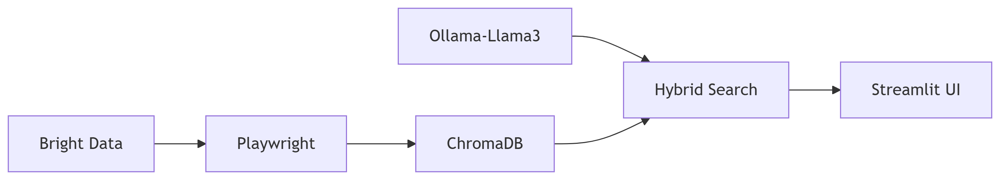

# 🔍 LlamaSleuth: AI-Powered Web Investigator

**Uncover hidden insights from any webpage using local AI and RAG technology.**  
*Detect scams, summarize content, and analyze data.*

---

## 🌟 Features
- **Local Web Scraping**: Selenium + ChromeDriver (no external APIs)
- **Smart Analysis**: RAG-powered with Ollama (Llama3) and ChromaDB
- **Offline-First**: Works without internet after initial setup
- **User-Friendly UI**: Streamlit dashboard for easy interaction

**Use Cases**:
- 🚨 Fake job/internship detection
- 📰 News/article summarization
- 🔍 Company/product research

---

## 🛠️ Installation

### Prerequisites
- Python 3.9+
- [ChromeDriver](https://chromedriver.chromium.org/downloads) (match your Chrome version)
- [Ollama](https://ollama.ai) (for local LLMs)

### Steps
1. Clone the repository:
   ` ```bash ` 
   git clone https://github.com/yourusername/LlamaSleuth.git
   cd NaviQA
2. Install dependencies:
  ` ```bash ` 
   pip install -r requirements.txt
3. Download AI models:
  ` ```bash ` 
   ollama pull llama3
   ollama pull mxbai-embed-large
4. Place chromedriver.exe in project root

## 🚀 Quick Start

### Web Interface
` ```bash ` 
streamlit run main.py
1. Enter a URL in the input box</li>
2. Click &quot;Scrape Site&quot;</li>
3. Ask questions about the content (e.g., Is this job posting legitimate?)

### Programmatic Use
` ```python `
from scrape import scrape_website
from parse import analyze_content

content = scrape_website("https://example.com")
analysis = analyze_content(content, "Summarize key points")
print(analysis)

## 📂 Project Structure
```
TruthHound/
├── .gitignore
├── README.md
├── requirements.txt
├── main.py                # Streamlit interface
├── scrape.py              # Web scraping logic
│   ├── scrape_website()
│   └── clean_content()
├── parse.py               # RAG processing
│   ├── analyze_content()
│   └── chunk_text()
└── chromedriver.exe       # Browser automation
```
     

### 🤖 Tech Stack


### ⚠️ Troubleshooting
Issue	Solution
ChromeDriver error	Download matching version from here
Ollama model not found	Run ollama pull llama3
Memory issues	Reduce chunk size in parse.py</p>

